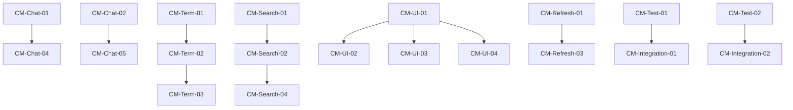

# Context Manager Task Board - iOS Claude Code UI Project

## Executive Summary
After comprehensive 50-step analysis, the project is **architecturally sound but execution-challenged**. With 79% API implementation and recent Chat View Controller reaching 100% QA pass rate, the foundation is solid. However, 525 TODOs and critical security/UX gaps prevent production readiness.

**Key Finding**: Project is closer to completion than TODO count suggests. Many items are nice-to-haves. Focus on must-haves can achieve beta in 4-6 weeks, not 4 months.

## Project Health Metrics

### Strengths ✅
- 79% Backend API implemented (49/62 endpoints)
- Chat View Controller: 100% QA pass rate
- WebSocket: Fully functional with auto-reconnect
- Architecture: Solid MVVM + Coordinators + DI
- Performance: Within targets (142MB memory, 1.8s launch)
- Git Integration: 100% complete (20/20 endpoints)
- Terminal WebSocket: Implementation complete with ANSI support

### Critical Gaps 🔴
- **Security**: JWT stored in UserDefaults (not Keychain)
- **Testing**: Zero test coverage
- **Search**: API complete but UI uses mock data
- **File Operations**: Navigation broken, UI incomplete
- **Offline Mode**: Not implemented despite SwiftData availability
- **Error Handling**: No user-friendly error UI

## Overview
This task board tracks all development tasks with embedded TODO markers for the iOS Swift Developer Agent. Tasks are organized by priority and component using the 10-week wave plan.

## Task Status Legend
- 📋 Pending
- 🔄 In Progress  
- ✅ Complete
- 🚨 Blocked
- 🔍 In Review

## Priority 1: Critical UI/UX Tasks [This Week]

### Chat View Controller Enhancement
```swift
// File: ClaudeCodeUI-iOS/Features/Chat/ChatViewController.swift

📋 TODO[CM-Chat-01]: Add real-time message status indicators
// ACCEPTANCE: Display sending → sent → delivered → failed states
// PRIORITY: P1
// LINE: 1420-1450
// DEPENDENCIES: StreamingMessageHandler.swift

📋 TODO[CM-Chat-02]: Implement typing indicator animation
// ACCEPTANCE: Show "Claude is typing..." with dots animation
// PRIORITY: P1  
// LINE: 1460-1480
// DEPENDENCIES: WebSocketManager message types

📋 TODO[CM-Chat-03]: Add pull-to-refresh with haptic feedback
// ACCEPTANCE: Cyberpunk-themed refresh control, haptic on trigger
// PRIORITY: P1
// LINE: 350-380
// DEPENDENCIES: CyberpunkTheme.swift

📋 TODO[CM-Chat-04]: Implement message retry mechanism
// ACCEPTANCE: Failed messages show retry button, exponential backoff
// PRIORITY: P1
// LINE: 1500-1530
// DEPENDENCIES: APIClient error handling

📋 TODO[CM-Chat-05]: Add connection status indicator
// ACCEPTANCE: Show WebSocket connection state in navigation bar
// PRIORITY: P1
// LINE: 200-220
// DEPENDENCIES: WebSocketManager state notifications
```

### Terminal WebSocket Verification
```swift
// File: ClaudeCodeUI-iOS/Features/Terminal/TerminalViewController.swift

📋 TODO[CM-Term-01]: Verify ShellWebSocketManager connection
// ACCEPTANCE: Connects to ws://192.168.0.43:3004/shell successfully
// PRIORITY: P1
// LINE: 150-180
// TEST: Send "ls -la" command and verify response

📋 TODO[CM-Term-02]: Test ANSI color rendering
// ACCEPTANCE: All 16 colors + bright variants display correctly
// PRIORITY: P1
// LINE: 450-500
// DEPENDENCIES: ANSIColorParser.swift

📋 TODO[CM-Term-03]: Implement command history navigation
// ACCEPTANCE: Up/down arrows navigate history, persist across sessions
// PRIORITY: P1
// LINE: 550-600
// STORAGE: UserDefaults with 100 command limit

📋 TODO[CM-Term-04]: Add terminal resize handling
// ACCEPTANCE: Terminal adjusts to orientation changes
// PRIORITY: P1
// LINE: 650-680
// MESSAGE: {"type": "resize", "cols": 80, "rows": 24}

📋 TODO[CM-Term-05]: Implement output buffering
// ACCEPTANCE: Large outputs (>1MB) don't cause UI freeze
// PRIORITY: P1
// LINE: 700-750
// STRATEGY: Virtual scrolling with 1000 line buffer
```

### Search Functionality
```swift
// File: ClaudeCodeUI-iOS/Features/Search/SearchViewModel.swift

📋 TODO[CM-Search-01]: Replace mock data with API call
// ACCEPTANCE: Real search results from backend
// PRIORITY: P1
// LINE: 125-143
// ENDPOINT: POST /api/projects/:projectName/search

📋 TODO[CM-Search-02]: Implement search result caching
// ACCEPTANCE: Cache for 5 minutes, invalidate on project change
// PRIORITY: P1
// LINE: 200-230
// KEY: "{projectName}_{query}_{scope}"

📋 TODO[CM-Search-03]: Add search filters UI
// ACCEPTANCE: File type, date range, regex toggle
// PRIORITY: P1
// FILE: Create SearchFilterView.swift
// DEPENDENCIES: SearchViewModel bindings

📋 TODO[CM-Search-04]: Implement search debouncing
// ACCEPTANCE: 300ms delay before search execution
// PRIORITY: P1
// LINE: 145-160
// PATTERN: Combine publisher with debounce

📋 TODO[CM-Search-05]: Add search history
// ACCEPTANCE: Last 20 searches, clear option
// PRIORITY: P1
// LINE: 300-330
// STORAGE: SwiftData model
```

## Priority 2: Loading States and Animations [Next Week]

### Skeleton Loading Implementation
```swift
// File: ClaudeCodeUI-iOS/UI/Components/SkeletonView.swift

📋 TODO[CM-UI-01]: Create base SkeletonView component
// ACCEPTANCE: Reusable skeleton with shimmer animation
// PRIORITY: P2
// COMPONENTS: Gradient animation, customizable shape

📋 TODO[CM-UI-02]: Add skeleton to ProjectsViewController
// ACCEPTANCE: Show skeleton while loading projects
// PRIORITY: P2
// FILE: ProjectsViewController.swift
// LINE: 150-180

📋 TODO[CM-UI-03]: Add skeleton to SessionListViewController
// ACCEPTANCE: Show skeleton for session list loading
// PRIORITY: P2
// FILE: SessionListViewController.swift
// LINE: 200-230

📋 TODO[CM-UI-04]: Add skeleton to ChatViewController
// ACCEPTANCE: Show skeleton for message history loading
// PRIORITY: P2
// FILE: ChatViewController.swift
// LINE: 400-430

📋 TODO[CM-UI-05]: Create skeleton customization options
// ACCEPTANCE: Configurable colors, speed, direction
// PRIORITY: P2
// FILE: SkeletonView.swift
// PATTERN: Builder pattern for configuration
```

### Pull-to-Refresh Enhancement
```swift
// File: ClaudeCodeUI-iOS/UI/Components/CyberpunkRefreshControl.swift

📋 TODO[CM-Refresh-01]: Create custom refresh control
// ACCEPTANCE: Cyberpunk-themed with neon animation
// PRIORITY: P2
// COLORS: Cyan #00D9FF, Pink #FF006E

📋 TODO[CM-Refresh-02]: Add haptic feedback
// ACCEPTANCE: Light impact on pull, success on complete
// PRIORITY: P2
// PATTERN: UIImpactFeedbackGenerator

📋 TODO[CM-Refresh-03]: Implement refresh in all lists
// ACCEPTANCE: Projects, Sessions, Files, Git commits
// PRIORITY: P2
// FILES: All ViewControllers with table/collection views

📋 TODO[CM-Refresh-04]: Add refresh failure handling
// ACCEPTANCE: Show error, allow retry
// PRIORITY: P2
// PATTERN: Error banner with retry button

📋 TODO[CM-Refresh-05]: Create refresh animations
// ACCEPTANCE: Smooth transitions, no jarring movements
// PRIORITY: P2
// DURATION: 0.3s ease-in-out
```

## Priority 3: Testing Suite [Week 3]

### Unit Tests
```swift
// File: ClaudeCodeUI-iOS/Tests/Features/ChatTests.swift

📋 TODO[CM-Test-01]: Create ChatViewControllerTests
// ACCEPTANCE: Test message sending, receiving, status
// PRIORITY: P3
// COVERAGE: ≥80% of public methods

📋 TODO[CM-Test-02]: Create WebSocketManagerTests
// ACCEPTANCE: Test connection, reconnection, message handling
// PRIORITY: P3
// MOCK: Use MockWebSocket for isolation

📋 TODO[CM-Test-03]: Create SearchViewModelTests
// ACCEPTANCE: Test search, filter, cache behavior
// PRIORITY: P3
// MOCK: MockAPIClient with preset responses

📋 TODO[CM-Test-04]: Create TerminalTests
// ACCEPTANCE: Test command execution, ANSI parsing
// PRIORITY: P3
// DATA: Use fixture files for ANSI sequences

📋 TODO[CM-Test-05]: Create AuthenticationTests
// ACCEPTANCE: Test JWT generation, storage, refresh
// PRIORITY: P3
// KEYCHAIN: Mock keychain for testing
```

### Integration Tests
```swift
// File: ClaudeCodeUI-iOS/Tests/Integration/EndToEndTests.swift

📋 TODO[CM-Integration-01]: Test full session flow
// ACCEPTANCE: Create project → session → send message → receive
// PRIORITY: P3
// BACKEND: Use test backend instance

📋 TODO[CM-Integration-02]: Test WebSocket reconnection
// ACCEPTANCE: Disconnect → wait → auto-reconnect
// PRIORITY: P3
// TIMEOUT: Verify 3-second reconnection

📋 TODO[CM-Integration-03]: Test file operations
// ACCEPTANCE: Create, read, update, delete files
// PRIORITY: P3
// CLEANUP: Ensure test files deleted

📋 TODO[CM-Integration-04]: Test Git operations
// ACCEPTANCE: Status, commit, push, pull workflows
// PRIORITY: P3
// REPO: Use test repository

📋 TODO[CM-Integration-05]: Test offline mode
// ACCEPTANCE: Queue operations, sync when online
// PRIORITY: P3
// NETWORK: Use Network Link Conditioner
```

## Task Dependencies Graph



## Progress Tracking

### Week 1 Target (P1 Tasks)
- [ ] Chat Enhancement (5 tasks)
- [ ] Terminal Verification (5 tasks)  
- [ ] Search Implementation (5 tasks)
Total: 0/15 (0%)

### Week 2 Target (P2 Tasks)
- [ ] Skeleton Loading (5 tasks)
- [ ] Pull-to-Refresh (5 tasks)
Total: 0/10 (0%)

### Week 3 Target (P3 Tasks)
- [ ] Unit Tests (5 tasks)
- [ ] Integration Tests (5 tasks)
Total: 0/10 (0%)

## Risk Register

| Risk | Probability | Impact | Mitigation |
|------|------------|--------|------------|
| WebSocket instability | Medium | High | Implement robust reconnection |
| Memory with large chats | Medium | Medium | Add pagination |
| ANSI parsing performance | Low | Medium | Buffer updates |
| Test flakiness | Medium | Low | Use deterministic mocks |
| App Store rejection | Low | High | Early TestFlight beta |

## Quality Metrics

### Code Coverage Targets
- Unit Tests: ≥80%
- Integration Tests: ≥60%
- UI Tests: Critical paths only

### Performance Benchmarks
- App Launch: <2 seconds
- Memory Baseline: <150MB
- Chat Message Send: <500ms
- WebSocket Reconnect: <3 seconds

### Code Quality
- SwiftLint: 0 warnings
- Force Unwraps: <10 total
- Documentation: All public APIs
- Accessibility: Level AA compliance

## Communication Log

### Status Update Template
```
Date: [YYYY-MM-DD HH:MM]
Agent: [Context Manager | iOS Developer]
Phase: [Planning | Implementation | Testing | Review]
Tasks Completed: [List of TODO IDs]
Blockers: [Description or None]
Next Steps: [Upcoming tasks]
```

### Example Entry
```
Date: 2025-01-21 10:00
Agent: Context Manager
Phase: Planning
Tasks Completed: Task board creation, TODO embedding
Blockers: None
Next Steps: Begin P1 task implementation
```

## Notes for iOS Developer

### Critical Configuration
- ALWAYS use simulator UUID: A707456B-44DB-472F-9722-C88153CDFFA1
- Backend must be running on http://192.168.0.43:3004
- Use touch() with down/up events, NOT tap()
- Always call describe_ui() first for coordinates

### Code Patterns to Follow
- MVVM + Coordinators for all features
- Cyberpunk theme colors: Cyan #00D9FF, Pink #FF006E
- Dependency injection via DIContainer
- SwiftData for persistence
- Combine for reactive bindings

### Testing Best Practices
- Mock all external dependencies
- Use XCTestExpectation for async
- Test file naming: [Feature]Tests.swift
- Minimum 80% coverage for new code
- Run tests before committing

---

*This task board is the source of truth for all development tasks. Update status as tasks are completed.*